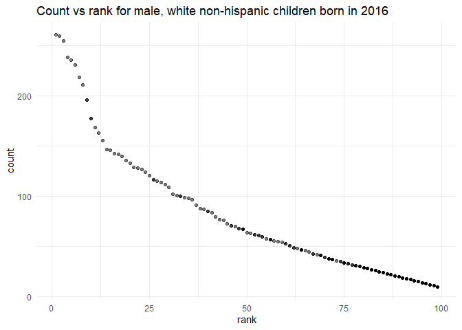

hw2\_zh2493
================
Ziqian
2021/10/4

``` r
library(tidyverse)
library(readxl)
library(lubridate)
library(ggplot2)
```

## P1

Read and clean the Mr. Trash Wheel sheet:

``` r
wheel_sheet = 
  read_excel("./data./Trash-Wheel-Collection-Totals-7-2020-2.xlsx", range = "A2:N408", sheet = "Mr. Trash Wheel") %>%
  na.omit(dumpster) %>%
  janitor::clean_names() %>%
  mutate(sports_balls = round(as.numeric(sports_balls)))
```

### Read and clean precipitation data for 2018 and 2019

``` r
precipitation2018 = 
  read_excel("./data./Trash-Wheel-Collection-Totals-7-2020-2.xlsx", sheet = "2018 Precipitation", range = "A2:B14") %>%
  na.omit(wheel_sheet,  Precipitation) %>%
  janitor::clean_names() %>%
  mutate(year = "2018") %>%
  select(year, month, total)
  
precipitation2019 = 
  read_excel("./data./Trash-Wheel-Collection-Totals-7-2020-2.xlsx", sheet = "2019 Precipitation", range = "A2:B14") %>%
  na.omit(wheel_sheet,  Precipitation) %>%
  janitor::clean_names() %>%
  mutate(year = "2019") %>%
  select(year, month, total)

precipitation_2018_2019 = 
  combine(precipitation2018, precipitation2019) %>%
  mutate(month = month.name[month])
```

### Briefly introduce these data

In MR. Trash Wheel dataset, there are 345 observations and 14 columns.
Dumpster is the count of dump time.

The precipitation dataset contains 24 observations and 3 columns,
including 12 months in 2018 and 12 months in 2019.

The total precipitation in 2018 is 70.33

The median number of sports balls in a dumpster in 2019 is 9

## P2

### First

``` r
poly = 
  read.csv("./data./fivethirtyeight_datasets./pols-month.csv") %>%
  janitor::clean_names() %>%
  separate(mon, into = c("year", "month", "day")) %>%
  mutate(year = as.integer(year), month = as.integer(month), day = as.integer(day)) %>% 
  mutate(month = month.name[as.numeric(month)]) %>%
  mutate(year = as.numeric(year)) %>%
  mutate(president = ifelse(prez_gop == 1, 'gop', 'dem')) %>%
  mutate(month = substring(month, 0, 3)) %>%
  filter(president != "prez_dem" & president != "prez_gop") %>%
  select(-"prez_gop", -"prez_dem", -"day")

head(poly) %>% knitr::kable()
```

| year | month | gov\_gop | sen\_gop | rep\_gop | gov\_dem | sen\_dem | rep\_dem | president |
|-----:|:------|---------:|---------:|---------:|---------:|---------:|---------:|:----------|
| 1947 | Jan   |       23 |       51 |      253 |       23 |       45 |      198 | dem       |
| 1947 | Feb   |       23 |       51 |      253 |       23 |       45 |      198 | dem       |
| 1947 | Mar   |       23 |       51 |      253 |       23 |       45 |      198 | dem       |
| 1947 | Apr   |       23 |       51 |      253 |       23 |       45 |      198 | dem       |
| 1947 | May   |       23 |       51 |      253 |       23 |       45 |      198 | dem       |
| 1947 | Jun   |       23 |       51 |      253 |       23 |       45 |      198 | dem       |

### Second

``` r
snp = 
  read.csv("./data./fivethirtyeight_datasets./snp.csv") %>%
  janitor::clean_names() %>%
  mutate(date,date = lubridate::mdy(date)) %>%
  separate(date, into = c("year", "month", "day")) %>%
  mutate(month = month.name[as.numeric(month)]) %>%
  mutate(year = as.numeric(year)) %>%
  mutate(year = ifelse(year>2049, year - 100, year)) %>%
  select(year, month, everything()) %>%
  select(-"day") %>%
  mutate(month = substring(month, 0, 3))

head(poly) %>% knitr::kable()
```

| year | month | gov\_gop | sen\_gop | rep\_gop | gov\_dem | sen\_dem | rep\_dem | president |
|-----:|:------|---------:|---------:|---------:|---------:|---------:|---------:|:----------|
| 1947 | Jan   |       23 |       51 |      253 |       23 |       45 |      198 | dem       |
| 1947 | Feb   |       23 |       51 |      253 |       23 |       45 |      198 | dem       |
| 1947 | Mar   |       23 |       51 |      253 |       23 |       45 |      198 | dem       |
| 1947 | Apr   |       23 |       51 |      253 |       23 |       45 |      198 | dem       |
| 1947 | May   |       23 |       51 |      253 |       23 |       45 |      198 | dem       |
| 1947 | Jun   |       23 |       51 |      253 |       23 |       45 |      198 | dem       |

### Third

``` r
unemployment = 
  read.csv("./data./fivethirtyeight_datasets./unemployment.csv") %>%
  pivot_longer(Jan:Dec, names_to = "month", values_to = "num") %>%
  janitor::clean_names() %>%
  select(year, month, everything()) %>%
  mutate(year = as.numeric(year))

head(poly) %>% knitr::kable()
```

| year | month | gov\_gop | sen\_gop | rep\_gop | gov\_dem | sen\_dem | rep\_dem | president |
|-----:|:------|---------:|---------:|---------:|---------:|---------:|---------:|:----------|
| 1947 | Jan   |       23 |       51 |      253 |       23 |       45 |      198 | dem       |
| 1947 | Feb   |       23 |       51 |      253 |       23 |       45 |      198 | dem       |
| 1947 | Mar   |       23 |       51 |      253 |       23 |       45 |      198 | dem       |
| 1947 | Apr   |       23 |       51 |      253 |       23 |       45 |      198 | dem       |
| 1947 | May   |       23 |       51 |      253 |       23 |       45 |      198 | dem       |
| 1947 | Jun   |       23 |       51 |      253 |       23 |       45 |      198 | dem       |

### join

``` r
merge_df = left_join(poly,snp, by = c("year", "month"))
merge_df = left_join(merge_df,unemployment, by = c("year", "month"))
  
head(poly) %>% knitr::kable()
```

| year | month | gov\_gop | sen\_gop | rep\_gop | gov\_dem | sen\_dem | rep\_dem | president |
|-----:|:------|---------:|---------:|---------:|---------:|---------:|---------:|:----------|
| 1947 | Jan   |       23 |       51 |      253 |       23 |       45 |      198 | dem       |
| 1947 | Feb   |       23 |       51 |      253 |       23 |       45 |      198 | dem       |
| 1947 | Mar   |       23 |       51 |      253 |       23 |       45 |      198 | dem       |
| 1947 | Apr   |       23 |       51 |      253 |       23 |       45 |      198 | dem       |
| 1947 | May   |       23 |       51 |      253 |       23 |       45 |      198 | dem       |
| 1947 | Jun   |       23 |       51 |      253 |       23 |       45 |      198 | dem       |

### Briefly introduce these data

poly contains 822 observations and 9 variables. Years ranges from 1947
to 2015.The names of the variables are year, month, gov\_gop, sen\_gop,
rep\_gop, gov\_dem, sen\_dem, rep\_dem, president and the president
variable indicates the president is democratic or republican.

snp contains 787 observations and 3 variables. Years ranges from 1950 to
2015.The names of the variables are year, month, close and the president
variable indicates the president is democratic or republican.

unemployment contains 816 observations and 3 variables. Years ranges
from 1948 to 2015.The names of the variables are year, month, num and
the president variable indicates the president is democratic or
republican.

## P3

### tidy the data of baby names

``` r
table = 
  read.csv("./data./Popular_Baby_Names.csv") %>%
  janitor::clean_names() %>%
  distinct() %>%
  mutate(child_s_first_name = str_to_title(child_s_first_name)) %>%
  mutate(ethnicity = recode(ethnicity, 'ASIAN AND PACI' = 'ASIAN AND PACIFIC ISLANDER', 'BLACK NON HISP' = 'BLACK NON HISPANIC', 'WHITE NON HISP' = 'WHITE NON HISPANIC')) %>%
  distinct() 

head(poly) %>% knitr::kable()
```

| year | month | gov\_gop | sen\_gop | rep\_gop | gov\_dem | sen\_dem | rep\_dem | president |
|-----:|:------|---------:|---------:|---------:|---------:|---------:|---------:|:----------|
| 1947 | Jan   |       23 |       51 |      253 |       23 |       45 |      198 | dem       |
| 1947 | Feb   |       23 |       51 |      253 |       23 |       45 |      198 | dem       |
| 1947 | Mar   |       23 |       51 |      253 |       23 |       45 |      198 | dem       |
| 1947 | Apr   |       23 |       51 |      253 |       23 |       45 |      198 | dem       |
| 1947 | May   |       23 |       51 |      253 |       23 |       45 |      198 | dem       |
| 1947 | Jun   |       23 |       51 |      253 |       23 |       45 |      198 | dem       |

### produce a table about Olivia

``` r
Olivia = 
  table %>%
  filter(gender == "FEMALE", child_s_first_name == "Olivia") %>% 
  select(-"count", -"gender", -"child_s_first_name") %>% 
  pivot_wider(names_from = year_of_birth, values_from = rank)

head(poly) %>% knitr::kable()
```

| year | month | gov\_gop | sen\_gop | rep\_gop | gov\_dem | sen\_dem | rep\_dem | president |
|-----:|:------|---------:|---------:|---------:|---------:|---------:|---------:|:----------|
| 1947 | Jan   |       23 |       51 |      253 |       23 |       45 |      198 | dem       |
| 1947 | Feb   |       23 |       51 |      253 |       23 |       45 |      198 | dem       |
| 1947 | Mar   |       23 |       51 |      253 |       23 |       45 |      198 | dem       |
| 1947 | Apr   |       23 |       51 |      253 |       23 |       45 |      198 | dem       |
| 1947 | May   |       23 |       51 |      253 |       23 |       45 |      198 | dem       |
| 1947 | Jun   |       23 |       51 |      253 |       23 |       45 |      198 | dem       |

### produce a table about the most popular name among male

``` r
popular_male = 
  table %>% 
  filter(gender == "MALE", rank == "1") %>% 
  select(-"gender", -"count", -"rank") %>% 
  pivot_wider(names_from = year_of_birth, values_from = child_s_first_name)

head(poly) %>% knitr::kable()
```

| year | month | gov\_gop | sen\_gop | rep\_gop | gov\_dem | sen\_dem | rep\_dem | president |
|-----:|:------|---------:|---------:|---------:|---------:|---------:|---------:|:----------|
| 1947 | Jan   |       23 |       51 |      253 |       23 |       45 |      198 | dem       |
| 1947 | Feb   |       23 |       51 |      253 |       23 |       45 |      198 | dem       |
| 1947 | Mar   |       23 |       51 |      253 |       23 |       45 |      198 | dem       |
| 1947 | Apr   |       23 |       51 |      253 |       23 |       45 |      198 | dem       |
| 1947 | May   |       23 |       51 |      253 |       23 |       45 |      198 | dem       |
| 1947 | Jun   |       23 |       51 |      253 |       23 |       45 |      198 | dem       |

### for male, white non-hispanic children born in 2016

``` r
white_non_hispanic = 
  table %>% 
  filter(year_of_birth == "2016", gender == "MALE", ethnicity == "WHITE NON HISPANIC")

ggplot(white_non_hispanic, aes(x = rank, y = count)) +
  geom_point(alpha = .5) +
  ggtitle("Count vs rank for male, white non-hispanic children born in 2016") +
  theme_minimal()
```

<!-- -->
